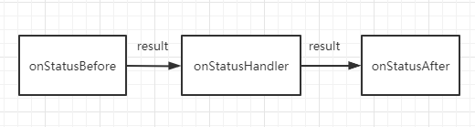

# HTTP Response Status Code Processing
This can be said to be one of the core parts of Axios sugar, and many functions depend on it.
::: tip
Error retransmission and network state processing depend on it.
:::

## Processing flow
  
The onStatusHander represents the processing function called for each status
| status code | function |
| --- | --- |
| 400 | onBadRequest |
| 401 | onUnauthorized |
| 403 | onForbidden |
| 404 | onNotFound |
| 405 | onMethodNotAllow |
| 406 | onNotAcceptable |
| 407 | onProxyAuthenticationRequired |
| 408 | onTimeout |
| 409 | onConflict |
| 500 | onInternalServerError |
| 501 | onNotImplemented |
| 502 | onBadGateway |

You can override these methods to customize handler for special status code.
重写这些方法可以实现对对应状态码的自定义处理。
```ts
import AxiosSugar from 'axios-sugar';

// override onBadRequest
AxiosSugar.httpStatusProcessor.on('badRequest', function (
  status: string,
  err: MiddleResponseError,
  result: any,
  retry?: retry
) {
  // ....
  return result;
});

```
onStatusBefore and conStatusAfter includes `onXXXBefore`，`onXXXAfter` and themself.

`The first X of 'onxxbefore' and 'onxxxafter' can be a number from 1 to 5, such as' on5xxbefore '. They are used to process status codes that begin with a specific number.

On the other hand, 'onstatusbefore' and 'onstatus after' are global processing, and all status codes are processed, unless the corresponding 'onxxxbefore' and 'onxxxafter' corresponding to the status code are defined.  

> In other words, 'onxxxbefore' and 'onxxxafter' are preferred to handle the error response. If the corresponding function cannot be matched, the 'onstatusbefore' and 'onstatusafter' are used uniformly.

::: warning
We can notice that every step of processing returns a result, which is passed to the function executed at each step in turn.

Therefore, the result returned by the previous function directly determines the value of the result parameter received by the next function.
:::
## User defined status code processing
It can be found that the default definition of the status code processing is incomplete, for example, there is no definition for the 200 status code processing function. In this case, you need to customize the corresponding function.
```js
AxiosSugar.httpStatusProcessor.setStatusHandler('200', function (
  status: string,
  err: MiddleResponseError,
  result: any,
  retry?: retry
) {
  // ....
  return result;
});
```